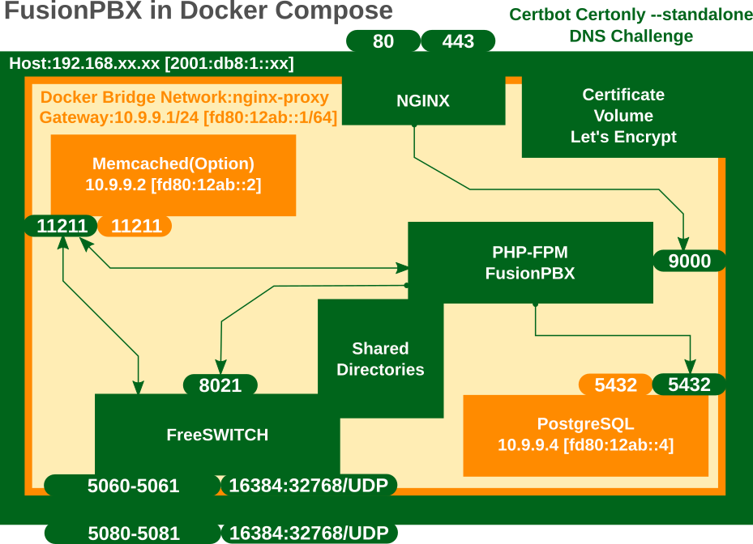
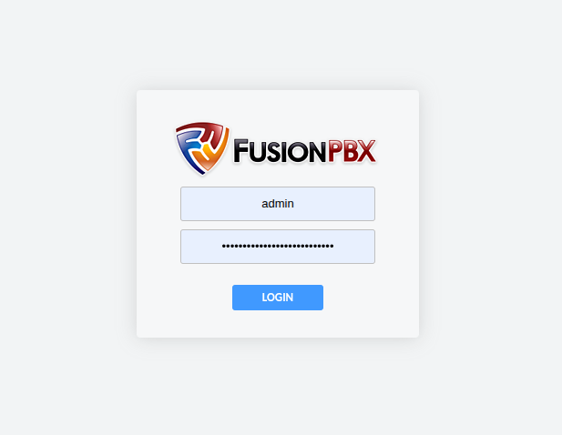
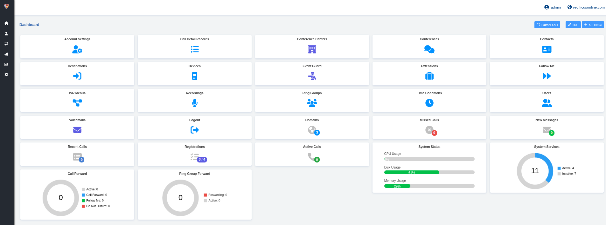

### Install FreeSWITCH(Debian)

https://developer.signalwire.com/freeswitch/FreeSWITCH-Explained/Installation/Linux/Debian_67240088/

### System Information
* Version 5.5.0
* Git Information Branch: master
* Commit: [bc5275fdcdaf37dbadcea8cf32935561a78d66b2](https://github.com/fusionpbx/fusionpbx/commit/bc5275fdcdaf37dbadcea8cf32935561a78d66b2)
* Origin: https://github.com/fusionpbx/fusionpbx
* Project Path /var/www/fusionpbx
* Switch Version 1.10.12 (64bit)
* Switch Git Information unknown
* PHP Version 8.2.29


### Database Information
* Name	PostgreSQL
* Version	17.6



---

## This article summarizes the content of the following forum (work log).

For detailed explanations, please refer to the link below:

[https://forum.ficusonline.com/t/topic/535/3](https://forum.ficusonline.com/t/topic/535/3)

The files presented here will be uploaded to GitHub.

---

## 1. Working Directory

As the working directory, we use the **`debian`** directory included in the official installation script.
Some of the scripts and configuration files in this directory will be reused across Docker containers.

```bash
$ git clone https://github.com/fusionpbx/fusionpbx-install.sh
$ cd fusionpbx-install.sh/debian
```

Among the downloaded files, the following 4 files are required for database and server configuration.
Please edit these contents according to your own environment.

> **Note:**
> To install FreeSWITCH into a Docker image, you will need an **access token**.
> Please obtain it in advance by referring to the following page:
> [https://developer.signalwire.com/freeswitch/FreeSWITCH-Explained/Installation/how-to-create-a-personal-access-token/how-to-create-a-personal-access-token/](https://developer.signalwire.com/freeswitch/FreeSWITCH-Explained/Installation/how-to-create-a-personal-access-token/how-to-create-a-personal-access-token/)

* `fusionpbx-install.sh/debian/resources/config.sh`
  Environment variable file referenced by various scripts. Requires an access token.
* `fusionpbx-install.sh/debian/resources/finish.sh`
  Script to initialize the database, etc. after the first Docker Compose startup.
* `fusionpbx-install.sh/debian/resources/fusionpbx/config.conf`
  FusionPBX configuration file.
* `fusionpbx-install.sh/debian/resources/nginx/fusionpbx`
  Nginx configuration file.

---

## 2. Downloading FusionPBX and Optional Packages

Within the above working directory, download the latest stable version of FusionPBX and add optional packages to `fusionpbx/app`.

**Download FusionPBX**

```bash
$ git clone $branch https://github.com/fusionpbx/fusionpbx.git
```

**Optional Packages**

```bash
$ git clone https://github.com/fusionpbx/fusionpbx-app-transcribe.git ./fusionpbx/app/transcribe
$ git clone https://github.com/fusionpbx/fusionpbx-app-speech.git ./fusionpbx/app/speech
$ git clone https://github.com/fusionpbx/fusionpbx-app-device_logs.git ./fusionpbx/app/device_logs
$ git clone https://github.com/fusionpbx/fusionpbx-app-dialplan_tools.git ./fusionpbx/app/dialplan_tools
$ git clone https://github.com/fusionpbx/fusionpbx-app-edit.git ./fusionpbx/app/edit
$ git clone https://github.com/fusionpbx/fusionpbx-app-sip_trunks.git ./fusionpbx/app/sip_trunks
$ sudo chown -R www-data:www-data /var/www/fusionpbx /var/cache/fusionpbx /etc/freeswitch
```

---

## 3. Building Custom Docker Images

FusionPBX consists mainly of **nginx**, **php-fpm**, **postgresql**, and **freeswitch**.
Among these, **php-fpm** and **freeswitch** will be built as **custom images** optimized for FusionPBX.

To build these custom images, create Dockerfiles inside the `docker_files` directory and build each image accordingly.

### 3-1. Building the PHP-FPM Custom Image

The FusionPBX source code will be placed inside this container via the Docker Compose file.

```bash
$ mkdir docker_files
```

`docker_files/php-fpm-fusionpbx`

`docker_files/entrypoint.sh`

**Build**

```bash
$ docker build -f $(pwd)/docker_files/php-fpm-fusionpbx -t php-8.2-fpm:20250817 $(pwd)/docker_files
```

---

### 3-2. Building the FreeSWITCH Custom Image

For the FreeSWITCH image, download the official package from the following repository and customize it as needed (via `git` or `svn`):

[https://github.com/signalwire/freeswitch/tree/master/docker/master](https://github.com/signalwire/freeswitch/tree/master/docker/master)

Create a new directory `freeswitch_master` under `docker_files`, and place all build-related files there.

```bash
$ mkdir freeswitch_master
```

Several package variants are available depending on functionality, but in this setup I install **`freeswitch-meta-bare`** and then manually add required modules instead of using the full **`freeswitch-meta-all`** package.

* freeswitch-meta-bare
* freeswitch-meta-vanilla
* freeswitch-meta-sorbet
* freeswitch-meta-all-dbg
* freeswitch-meta-all

`docker_files/freeswitch_master/Dockerfile`
`docker_files/freeswitch_master/docker-entrypoint.sh`
`docker_files/freeswitch_master/build/freeswitch.limits.conf`

**Build**

```bash
$ docker build -f $(pwd)/docker_files/freeswitch_master/Dockerfile -t freeswitch:20250817 $(pwd)/docker_files/freeswitch_master
```

**Verify built images**

```
$ docker images
REPOSITORY               TAG         IMAGE ID       CREATED        SIZE
php-8.2-fpm              20250817    xxxxxxxxxxxx   5 weeks ago    740MB
freeswitch               20250817    xxxxxxxxxxxx   6 weeks ago    2.11GB
```

---

## 4. Obtaining TLS Certificates

I will obtain TLS certificates using **Let’s Encrypt**.

Both Nginx and FreeSWITCH are configured for **IPv6 only**.
The domain is registered in **Cloudflare DNS** as an **AAAA record**, and the certificate is obtained via **DNS challenge**.

I use the following Cloudflare-specific Certbot container.
Your **Cloudflare account** and **API token** (stored in `cloudflare.ini`) are required.

[https://hub.docker.com/r/certbot/dns-cloudflare](https://hub.docker.com/r/certbot/dns-cloudflare)

```bash
$ docker run -it --rm --name certbot_cloudflare -v "/etc/letsencrypt:/etc/letsencrypt" -v "./cloudflare.ini:/opt/certbot/cloudflare.ini" certbot/dns-cloudflare:latest certonly --dns-cloudflare --dns-cloudflare-propagation-seconds 60 --dns-cloudflare-credentials ./cloudflare.ini -d ficusonline.com -d *.ficusonline.com
```

Nginx can directly use the obtained certificates,
but FreeSWITCH requires its own TLS certificate files to be created based on them.

Run the following commands on the host machine:

```bash
# cat ./letsencrypt/live/ficusonline.com/fullchain.pem > ./letsencrypt/live/ficusonline.com/all.pem
# cat ./letsencrypt/live/ficusonline.com/privkey.pem >> ./letsencrypt/live/ficusonline.com/all.pem
# cd ./letsencrypt
# ln -s live/ficusonline.com/all.pem agent.pem
# ln -s live/ficusonline.com/all.pem tls.pem
# ln -s live/ficusonline.com/all.pem wss.pem
# ln -s live/ficusonline.com/all.pem dtls-srtp.pem
```

---

## 5. Creating the Docker Compose File

The FreeSWITCH container must use **network_mode: host**.
Other containers may use any mode, but using host mode for Nginx and PHP-FPM allows reusing existing configuration files as-is.

Directories shared between the PHP-FPM and FreeSWITCH containers:

```yaml
      - ./resources/fusionpbx/config.conf:/etc/fusionpbx/config.conf
      - ./fusionpbx/app/switch/resources/conf:/etc/freeswitch
      - ./fusionpbx/app/switch/resources/scripts:/usr/share/freeswitch/scripts
      - freeswitch_lib:/var/lib/freeswitch
      - freeswitch_usr_lib:/usr/lib/freeswitch
      - freeswitch_share:/usr/share/freeswitch
      - freeswitch_log:/var/log/freeswitch
      - freeswitch_run:/var/run/freeswitch
      - ./cache:/var/cache/fusionpbx
```

When the PHP-FPM container starts, multiple PHP scripts are executed through **Supervisor**,
so a Supervisor configuration file must be created and mounted as follows:

```yaml
      - ./php-fpm_conf/php.ini:/usr/local/etc/php/php.ini
      - ./php-fpm_conf/supevisor.conf:/etc/supervisor/conf.d/supevisor.conf:ro
      - ./php_log:/var/log/supervisor
```

`docker-compose.yaml`

---

## 6. Starting FusionPBX

**Start containers**

```bash
$ docker compose up -d
```

After startup, execute the `finish.sh` script inside the PHP-FPM container.
This script creates the FreeSWITCH configuration tables, displays the access URL, admin account, and password.
Then you can log in via your web browser.

```bash
$ docker compose exec php-fpm bash
# cd /opt/fusionpbx-installer-sh 
# ./finish.sh

    Installation has completed.

    Use a web browser to login.
       domain name: https://000.000.000.000
       username: admin
       password: XXXXXXXXXXXXXXXXXXXXXXX

    The domain name in the browser is used by default as part of the authentication.
    If you need to login to a different domain then use username@domain.
       username: admin@x.x.x.x

    Additional information.
       https://fusionpbx.com/support.php
       https://www.fusionpbx.com
       http://docs.fusionpbx.com
       https://www.fusionpbx.com/training.php
```

Login


Dashboard


---

## 7. Security and Debugging

Refer to the installation scripts for additional host-level configurations.
For security, tools such as **iptables** and **fail2ban** are used.
For debugging, **sngrep** is recommended.


